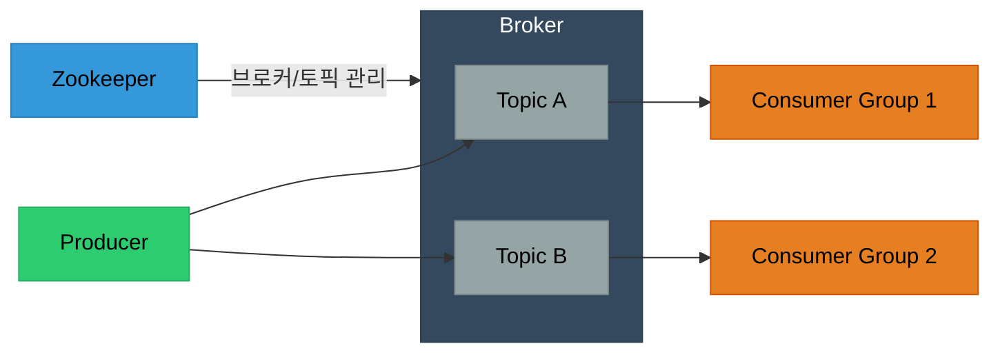

# 왜 해보는거임?

최근 프로젝트를 기획하고 진행할 예정에 있는데, 원하는 기능을 구현하기 위해 `MSA` 구조를 채택할 가능성이 있기에 미리 해볼 필요가 있다고 생각했다.

`MSA`에서 `Kafka`는 핵심이라고 생각하기에 ***더더욱!*** 할 필요가 있다고 생각했다.

# 목차

> 1. Docker에서 이미지 찾기
> 2. docker-compose 파일 작성하기

## Docker에서 이미지 찾기

우선 나는 3가지를 Docker Image로 찾으려한다.

1. `kafka`
2. `kafka-ui`
3. `zookeeper`

자 그렇다면 각각 어떤 기능을 하는 것인지 간략하게 알아보자.

### `kafka`

`kafka`는 apache 재단에서 개발한 분산형 스트리밍 플랫폼이다. 주로 대용량의 실시간 데이터를 처리하는 데 활용한다.

기존 시스템의 경우 중앙화된 데이터 전송 영역이없어 데이터의 흐름, 유지보수가 어려웠다. 또한 데이터베이스가 여러 시스템에 분산되어있는 경우 한 시스템에서 변경된 데이터가 다른 시스템에 즉시 반영되지 않는 데이터 일관성 문제가 존재했다.

`kafka`는 이와 같은 문제를 해결하기위해 링크드인에서 개발하고 현재는 `Apache Software Foundation`의 오픈 소스 프로젝트로 유지 관리되는 분산 스트리밍 플랫폼이다.

#### `kafka`의 구조

사실 위의 설명을 보면 이해가 어려울 수 있는데, 쉽게말해 데이터 전달의 택배회사가 `kafka`라고 생각하면된다.



그냥, 단순하게 데이터를 보내는 입장은 택배회사의 특정 지점에 데이터를 던지고, 데이터를 받는 입장에선 그냥 그 지점에서 필요할 때 데이터를 가져간다.

여기서 데이터를 보내는 입장은 `Producer`, 받는 입장은 `Consumer`, 중간 입장은 `Broker`이라고 부른다. 데이터를 분류하는 단위는 `Topic`이라고 부른다.

일단 여기까지 알아보자. 세부적인 것은 게시글을 따로 만들어 작성하려한다.

### `zookeeper`

분산 시스템 설계를 위해 필요한 코디네이션 서비스 시스템이 구현되어있는 오픈소스이다.
`kafka`와 같은 분산시스템에서 이를 많이 사용한다. 물론 3.0버전 이상에서는 `zookeeper` 없이 동작하는 모드가 있지만, 아직까지 안정적인 `kafka`를 위해 이를 활용한다.

그렇다면 `kafka`에서 `zookeeper`의 기능은 뭘까? 쉽게말해 **`kafka` 관리자** 역할을 한다 생각하면된다. 세부적인 기능은 다음과 같다.

1. 브로커 관리 : 클러스터 내의 브로커들을 관리한다. 브로커들의 생사를 파악한다.
2. 토픽 설정 관리 : 각 토픽의 파티션 수, 복제팩터 등의 정보를 저장하고 관리한다.
3. 리더 선출 : 파티션 리더가 실패했을 때 (오류겠지?) 새로운 리더를 선출한다.

여기서 파티션 리더라는 개념은 `kafka`에서 데이터가 어떻게 쌓이고 빠져나가는지를 이해해야하는데, 이는 `kafka`에 대한 게시글을 따로 작성하여 설명하려한다. 일단 이번 포스트에선 이정도만 알고 넘어가자.

## docker-compose


위의 과정에서 나는 다음 세개의 이미지를 Pull했다.

이를 `docker-compose.yaml`로 작성하고 `docker compose up`!

```yaml
services:
  zookeeper:
    image: bitnami/zookeeper:latest
    container_name: zookeeper
    ports:
      - 2181:2181
    environment:
      - ALLOW_ANONYMOUS_LOGIN=yes

  kafka:
    image: bitnami/kafka:latest
    container_name: kafka
    depends_on:
      - zookeeper
    ports:
      - 9092:9092
      - 9094:9094
    environment:
      - ALLOW_PLAINTEXT_LISTENER=yes
      - KAFKA_ENABLE_KRAFT=no
      - KAFKA_CFG_AUTO_CREATE_TOPICS_ENABLE=true
      - KAFKA_CFG_ZOOKEEPER_CONNECT=zookeeper:2181
      - KAFKA_CFG_LISTENERS=PLAINTEXT://:9092,CONTROLLER://:9093,EXTERNAL://:9094
      - KAFKA_CFG_ADVERTISED_LISTENERS=PLAINTEXT://kafka:9092,EXTERNAL://localhost:9094
      - KAFKA_CFG_LISTENER_SECURITY_PROTOCOL_MAP=CONTROLLER:PLAINTEXT,EXTERNAL:PLAINTEXT,PLAINTEXT:PLAINTEXT

  kafka-ui:
    image: provectuslabs/kafka-ui:latest
    container_name: kafka-ui
    depends_on:
      - kafka
    ports:
      - 8080:8080
    environment:
      - DYNAMIC_CONFIG_ENABLED=true
      - KAFKA_CLUSTERS_0_NAME=tradingSystem
      - KAFKA_CLUSTERS_0_BOOTSTRAPSERVERS=kafka:9092
```

이를 작성할 때 `environment`는 꼭 `docker` - `docker-hub` 에서 해당 이미지에 알맞는 정보를 입력하자~!

다음엔 `producer` 입장에서 메세지를 보내고, `consumer`가 수신하는 과정까지 진행하며 이를 기록할 예정이다.
