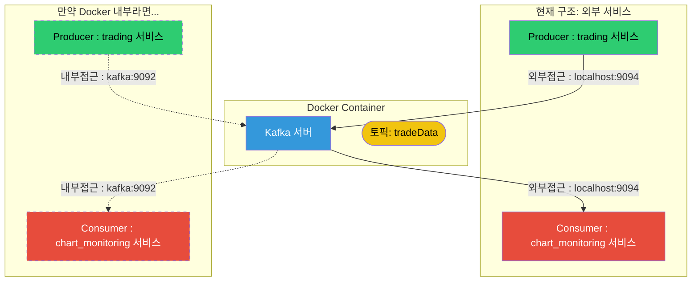

이 전편에서 `Docker`로 `Kafka`를 설정하는 것에 대해 다뤘다. 이어서 `Producer`와 `Consumer` 입장에서 `Kafka`를 다뤄보자.

딥한 내용보단 연결하고 보내는 것 까지 한번 진행해보자.

`Producer`, `Consumer`을 다른 포트의 `Nest`백엔드로 구현해서 서로 통신이 가능한지 확인하려한다.

참고로 아래의 과정을 진행하기위해선 `kafkajs`의 설치, 전 게시물에서 다뤘던 `kafka` 세팅을 마무리 해야한다.

[kafka - docker](https://scorchedrice.github.io/posts/kafka-docker/)

## 목차

> 1. [Producer] module.ts
> 2. [Producer] service.ts
> 3. [Producer] controller.ts
> 4. Producer 연결 확인
> 5. [Consumer] service.ts
> 6. [Consumer] 접근 방식
> 7. Consumer 연결 확인

## [Producer] `module.ts`

우선, 카프카에 연결하기 위해선 카프카에 접속하기 위한 주소와 클라이언트 아이디가 필요하다. 이를 `.env`로 만들고 활용하기 위해 다음의 설정을 진행했다.

### `app.module.ts`
```ts
@Module({
  imports: [
    ConfigModule.forRoot({
      isGlobal: true, // 전역으로 사용하기 위함
      envFilePath: '.env', // .env 위치
    })
  ],
  controllers: [AppController],
  providers: [AppService],
})
export class AppModule {}
```

### `.env`

```dotenv
CLIENT_ID=tradeData
KAFKA_CLIENT_BOOTSTRAP_SERVER=localhost:9094
```

## [Producer] `service.ts`

`Kafka`를 연결하는 과정은 어렵지 않다. 그냥 관련 객체를 만들고 연결하면 끝 ..!

`app.service.ts`에서 다음의 로직으로 `Kafka`를 연결했다.

1. `kafka`객체 생성
   1. `CLIENT_ID`로 애플리케이션 식별자 설정
   2. `KAFKA_CLIENT_BOOTSTRAP_SERVER`로 카프카 서버 주소 설정
2. `producer` 인스턴스 설정 후 `connect`
3. `sendMessage`로직 구현, 실제로 메세지를 보내는 로직임.

구현 내용은 다음과 같다.

```ts
@Injectable()
export class AppService {
  // kafka 객체 생성
  private kafka = new Kafka({
    clientId: process.env.CLIENT_ID, // 애플리케이션 식별자
    brokers: [process.env.KAFKA_CLIENT_BOOTSTRAP_SERVER], // 카프카 서버 주소 목록
    logLevel: logLevel.INFO,
  })
  // producer 인스턴스 생성, 토픽이 없으면 자동 생성 옵션 추가했음.
  private producer = this.kafka.producer({allowAutoTopicCreation: true});

  // service 인스턴스가 생성될 때 kafka producer connect!
  constructor() {
    this.producer.connect();
  }

  // 메세지를 받으면 실행될 핵심 로직
  async sendMessage(
    topic : string,
    coinName : string,
    numOfCoin : number,
    price : number,
  ) {
    try {
      console.log('service-sendMessage', topic, coinName, price, numOfCoin);
      // topic과 message를 전송
      await this.producer.send({
        topic,
        messages: [{ value: JSON.stringify({
            coinName,
            numOfCoin,
            price,
          })
        }],
      })
    } catch (error) {
      console.log(`error sending message to Kafka : ${error.message}`)
    }
  }

  async disconnect() {
    await this.producer.disconnect();
  }
}
```

## [Producer] `controller.ts`

여기선 특정 API로 요청이 왔을 때, `service.ts`에서 정의한 `sendMessage()`가 동작하도록 기능을 구현할 것이다.

```ts
@Controller()
export class AppController {
  constructor(private readonly appService: AppService) {}

  // 메세지를 보낼 때 해당 경로로 POST!
  @Post('send-trading-data')
  async sendTradingData(
    @Body('topic') topic:string,
    @Body('coinName') coinName:string,
    @Body('price') price:number,
    @Body('numOfCoin') numOfCoin:number,
  ) {
    console.log(topic, coinName, price, numOfCoin);
    if (topic === undefined) {
      return 'topic is undefined'
    } else {
      // 받은 값을 가지고 service에서 정의한 sendMessage 실행
      await this.appService.sendMessage(topic, coinName, price, numOfCoin);
      return `topic ${topic} added`
    }
  }
}
```

## Producer 연결 확인

`Docker`로 `Kafka`를 연결하는것에 성공한 이후 같이 설치한 `kafka-ui`로 이를 확인해보자.

나의 경우엔 `localhost:8080`에서 이를 확인할 수 있도록 설정했다. 관련된 내용은 이전 포스트를 보면 이해될 것이다.


아무튼, 이와 같이 정상 연결됨을 확인했다.

이어서 `controller`에서 정의한 엔드포인트로 값을 보내보자.


정상적으로 메세지가 갔음을 확인할 수 있다.


`kafka-ui`에서도 정상적으로 토픽이 구독되고 값이 올라감을 확인할 수 있다.

<hr>

여기까지 했으면, `consumer`도 확인해야한다. 이어서 port 3001을 차지하는 nest 백엔드를 구현하겠다. 포트는 `main.ts`에서 바꾸고 작업을 진행한다.

<hr>

## [Consumer] `service.ts`

큰 로직은 `Producer`와 큰 차이가 없다. kafka 객체를 만들고 이를 연결하면 된다.

단, 실시간으로 오는 데이터를 받아야하기에 구독, 각 메세지별로 함수가 실행되는 기능을 구현하면 된다.

```ts
@Injectable()
export class AppService {
  // kafka 객체 생성
  private kafka = new Kafka({
    clientId: process.env.CLIENT_ID,
    brokers: [process.env.KAFKA_CLIENT_BOOTSTRAP_SERVER],
    logLevel: logLevel.INFO,
  })

  // consumer의 경우 group_id를 설정해야한다.
  private consumer = this.kafka.consumer({
    groupId: process.env.GROUP_ID
  })

  constructor() {
    this.consumer.connect().then(r => console.log('connected'));
    this.consumer.subscribe({ topics: ['tradeData']}).then(r => console.log('subscribe'))
    this.consumer.run({
      eachMessage: async(payload: EachMessagePayload) => {
        await this.consumerCallback(payload)
      }
    }).then(r => console.log('run'));
  }

  async consumerCallback(payload: EachMessagePayload) {
    console.log('✨✨✨✨✨✨✨')
    console.log('kafka message 도착')
    console.log(`topic : ${payload.topic}, Message: ${payload.message.value.toString()}`)
    console.log('✨✨✨✨✨✨✨')
  }
}
```

자 여기서 `.env`엔 무엇을 정의했냐 알아보자.

```dotenv
CLIENT_ID=tradeData
KAFKA_CLIENT_BOOTSTRAP_SERVER=localhost:9094
GROUP_ID=chartMonitoringGroup
```

## [Consumer] 접근 방식

사실 이 부분이 조금 긴가민가했다. 결론은 `Producer`에서 사용한걸 그대로 사용하면된다.

이는 `docker-compose.yaml`을 보면 알 수 있다.

```dockerfile
  kafka:
    image: bitnami/kafka:latest
    container_name: kafka
    depends_on:
      - zookeeper
    ports:
      - 9092:9092
      - 9094:9094
    environment:
      - ALLOW_PLAINTEXT_LISTENER=yes
      - KAFKA_ENABLE_KRAFT=no
      - KAFKA_CFG_AUTO_CREATE_TOPICS_ENABLE=true
      - KAFKA_CFG_ZOOKEEPER_CONNECT=zookeeper:2181
      - KAFKA_CFG_LISTENERS=PLAINTEXT://:9092,CONTROLLER://:9093,EXTERNAL://:9094
      - KAFKA_CFG_ADVERTISED_LISTENERS=PLAINTEXT://kafka:9092,EXTERNAL://localhost:9094
      - KAFKA_CFG_LISTENER_SECURITY_PROTOCOL_MAP=CONTROLLER:PLAINTEXT,EXTERNAL:PLAINTEXT,PLAINTEXT:PLAINTEXT
```

여기서 LISTENERS, ADVERTIESED_LISTENERS를 확인해보자. 여기서 알 수 있는 것은 `Docker`네트워크 내 애플리케이션은 `kafka:9092`로 접근해야하고, 외부 애플리케이션은 `localhost:9094`로 접근해야함을 알 수 있다.



이번 경우엔 도커파일엔 `zookeeper`, `kafka`, `kafka-ui`말고 올라간게 없으니 외부 접근 방식을 활용한다.

## [Consumer] 연결 확인


터미널에 콘솔이 잘 나오는 것을 보니 잘 도착함을 알 수 있다.


또 `kafka-ui`에 `consumer`로 등록되고 `_consumer_offsets`가 등록되어있는 것을 보니 정상 작동함을 확인할 수 있다.
