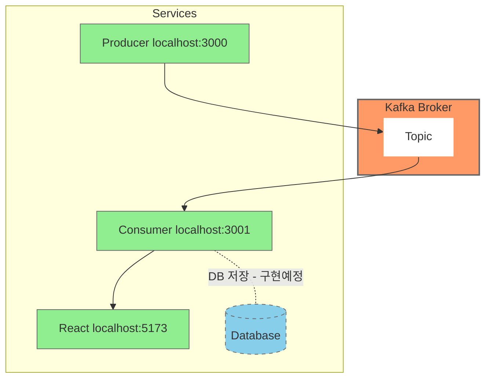

이번 게시글에선 받은 kafka 데이터를 websocket으로 FE에 전달하는 로직을 구현하려한다.

## `Nestjs` 소켓통신 환경 구축하기

### `yarn add`

```shell
yarn add @nestjs/websockets @nestjs/platform-socket.io socket.io
```

### 버전맞추기

websocket의 경우 버전이 다르면 오류가 쉽게 발생한다고함. `@nestjs/....`이런 애들은 버전을 맞춰줘야함.

버전이 낮은 것들을 `yarn add` 활용해서 업데이트해서 버전을 맞춰준다.

## `gateway.ts`

`Nest.js`에서 websocket은 `gateway.ts`가 담당한다.

`gateway.ts`에 다음과 같이 기능을 구현했다.

```ts
import {
  OnGatewayConnection,
  WebSocketGateway,
  WebSocketServer
} from "@nestjs/websockets";
import {Server, Socket} from "socket.io";

@WebSocketGateway({
  // ws://localhost:3001/chart_monitoring
  namespace: 'chart_monitoring',
  cors: {
    origin: ['http://localhost:5173'],
    credentials: true,
  }
})
export class AppGateway implements OnGatewayConnection {
  @WebSocketServer()
  server : Server

  // 연결되면 동작하는 함수
  handleConnection(socket: Socket): any {
    console.log('on connected called :', socket.id)
  }

  sendKafka(data : any) {
    // kafka라는 이벤트에 data를 보낼게
    this.server.emit('kafka', data)
  }
}
```

그리고 기존에 구현했던 kafka 메세지를 받고 console을 표시하는 로직에 gateway의 sendKafka를 실행하는 로직을 추가적으로 구현했다.

```ts
import { Injectable } from '@nestjs/common';
import {EachMessagePayload, Kafka, logLevel} from "kafkajs";
import {AppGateway} from "./app.gateway";

@Injectable()
export class AppService {
  // kafka 객체 생성
  private kafka = new Kafka({
    clientId: process.env.CLIENT_ID,
    brokers: [process.env.KAFKA_CLIENT_BOOTSTRAP_SERVER],
    logLevel: logLevel.INFO,
  })

  private consumer = this.kafka.consumer({
    groupId: process.env.GROUP_ID
  })

  constructor(
    private readonly appGateway: AppGateway
  ) {
    this.consumer.connect().then(r => console.log('connected'));
    this.consumer.subscribe({ topics: ['tradeData']}).then(r => console.log('subscribe'))
    this.consumer.run({
      eachMessage: async(payload: EachMessagePayload) => {
        await this.consumerCallback(payload)
      }
    }).then(r => console.log('run'));
  }

  async consumerCallback(payload: EachMessagePayload) {
    console.log('✨✨✨✨✨✨✨')
    console.log('kafka message 도착')
    console.log(`topic : ${payload.topic}, Message: ${payload.message.value.toString()}`)
    console.log('✨✨✨✨✨✨✨')
    // 도착했으니 저장하고 FE로 전달하는 과정 필요함.

    /**
     * 추후 DB에 저장하는 과정을 구현할 위치
     */

      // FE로 전달하는 과정
    const messageData = JSON.parse(payload.message.value.toString());
    this.appGateway.sendKafka(messageData);
  }
}
```

## React에서 값을 받아오는 과정

단순하게 값이 넘어올 때 마다 해당 값을 표시하는 로직으로 이를 구현해볼까한다.

```tsx
import kafka from './assets/kafka.svg'
import './App.css'
import {io} from "socket.io-client";
import {useEffect, useState} from "react";

function App() {
  const URL = import.meta.env.VITE_SOCKET_URL
  const socket = io(URL)
  const [receivedData, setReceivedData] = useState<any>(null)
  useEffect(() => {
    socket.on('connect', () => console.log('Connected!'))
    socket.on('kafka', (data) => {
      setReceivedData(data)
    })
  })
  return (
    <>
      <div>
        <a href="https://scorchedrice.github.io" target="_blank">
          
        </a>
      </div>
      <h1>Kafka Data Receive</h1>
      {receivedData ? <div className="card">
        <p>코인명 : {receivedData.coinName}</p>
        <p>거래된 코인 수 : {receivedData.numOfCoin}코인</p>
        <p>총 거래액 : {receivedData.price * receivedData.numOfCoin}포인트</p>
      </div> : null}
    </>
  )
}

export default App
```

## 결론

내가 구현한 기능의 아키텍처는 다음과 같다.



이런 나만의 개인 프로젝트를 진행한 이유도 계획중인 프로젝트에 앞서 Kafka 사용법을 알고자 함이였다.

비록 단순히 데이터를 주고 표시하는 단순한 구현이지만 사용법을 알게되어 좋았다.

DB 저장하는 기능은 아직 구현하지 않았지만, 추후 진행할 프로젝트에서 이를 구현하고 포스트로 공유해보겠다~!
