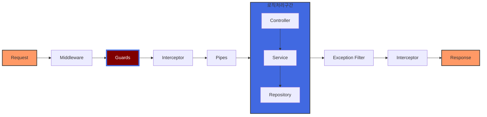

# Guard란



Nest의 라이프사이클을 보면 Guards는 로직처리구간 이전에 위치함을 알 수 있다.

Pipe에 도달하기 이전에 위치하기에 Guard를 통해 비효율적인 코드 실행을 방지할 수 있다.

또, Guard는 인증과정에서 주로 사용하는데, Guard를 사용하면 인증 로직을 깔끔하게 분리하고 재사용할 수 있으며 컨트롤러에선 핵심 비즈니스 로직에만 집중할 수 있다는 장점이 있다.

# 사용 방법

`~~.guard.ts`꼴로 파일을 생성하고 Nest에서 제공해주는 `UseGuards` 데코레이터를 활용하면 된다.

## 파일 생성 예시

Bearer 토큰 여부를 확인하는 Guard를 만든다고 생각해보자. 유효한 Guard를 만들기 위해선 다음과 같은 검증과정이 필요하다.

1. 토큰을 보냈는가
2. 토큰이 있다면 이 토큰이 유효한 토큰인가.

이와 같은 로직은 auth.service에 구현해두었기에 의존성을 주입하고 재사용하면 된다.

```ts
@Injectable()
export class BearerTokenGuard implements CanActivate {
  constructor(private readonly authService: AuthService,
              private readonly usersService: UsersService) {}
  async canActivate(context: ExecutionContext): Promise<boolean> {
    const req = context.switchToHttp().getRequest();
    // websocket 등 다른 것의 req도 상황에 맞게 수정하면 된다. (switchToHttp, switchToWs, switchToRpc)
    const rawToken = req.headers['authorization'];
    if (!rawToken) {
      throw new UnauthorizedException('토큰이 없습니다.')
      // 구현해야하는 1번 로직 : 토큰이 없다.
    }
    
    const token = this.authService.extractTokenFromHeader(rawToken, true);
    const result = await this.authService.verifyToken(token);
    // 위의 과정을 통해 만약 중간에 오류가 발생한다면 해당 로직에서 throw error 동작을 진행할 것임.

    const user = await this.usersService.getUserByEmail(result.email)
    req.token = token;
    req.tokenType = result.type;
    req.user = user;
    // 위의 과정을 모두 통과했다면 req에 해당 정보를 담는다.
    // 이후 담은 정보를 controller에서 활용할 수 있다. (하단 설명 참고)
    return true;
  }
}
```

AccessTokenGuard, RefreshTokenGuard 는 다음과 같이 구현할 수 있다.

```ts
@Injectable()
export class AccessTokenGuard extends BearerTokenGuard {
  async canActivate(context: ExecutionContext): Promise<boolean> {
    await super.canActivate(context);
    const req = context.switchToHttp().getRequest();
    if (req.tokenType !== 'access') {
      throw new UnauthorizedException('Access Token이 아닙니다.')
    }
    return true
  }
}
// refreshToken의 경우도 동일한 로직으로 수정
```

## Guard의 활용 (at Controller)

위에서 req.token = token; .. 이런식으로 하는 것을 보았다. `@Request`를 활용해 해당 정보를 Controller에서 활용할 수 있다.

이를 활용해 로그인한 유저만 글을 작성할 수 있도록 로직을 구현할 수 있다. (다른 유저가 글을 쓴 것처럼 조작하는 행위 방지)

```ts
// Token을 담아 보낸다 ? 여기서 유저 정보 가져올 수 있음.
@Post()
@UseGuards(AccessTokenGuard)
postPosts(
  @Request() req : any,
  @Body('title') title: string,
  @Body('content') content: string,
) {
  const author = req.user.id;
  return this.postsService.createPost(
    author, title, content,
  )
}
```

guard를 통과해서 온 것에 유저 아이디 정보가 담겨있기에 이를 활용할 수 있다. 

`AccessTokenGuard`를 통해 토큰 여부를 판단 ⇒ 토큰에 있는 user 정보를 통해 userId 가져오기

## Custom Decorator

만약 userId가 필요한 경우 매번 @Request를 사용하고 req.user.id 이런식으로 접근하는 것 보단 데코레이터를 커스텀해서 가져오는 것이 더 좋지 않을까? 이 때 CustomDecorator을 사용할 수 있다.

커스텀 데코레이터는 `~~.decorator.ts`꼴로 생성한다.

```ts
export const User = createParamDecorator((data : keyof UsersModel, context: ExecutionContext) => {
  const req = context.switchToHttp().getRequest();
  const user = req.user as UsersModel;
  // 서버에러를 던지는 이유 : Guard가 실행된 것을 전제로 진행하기에 클라이언트 측의 오류가 아닌 서버측의 오류라고 반환
  if (!user) {
    throw new InternalServerErrorException('User데코레이터는 AccessTokenGuard와 함께 사용해야합니다.');
  }

  // UserModel의 key값들이 data로 오니까, Decorator에 넣는 값에 따라 다른 값들을 반환
  if (data) {
    return user[data];
  }
  return user;
})
```

이와 같은 데코레이터를 생성했다면 상단의 @Request .. 부분을 대체할 수 있다.

```ts
@Post()
@UseGuards(AccessTokenGuard)
postPosts(
  @User('id') userId: number,
  @Body('title') title: string,
  @Body('content') content: string,
) {
  const authorId = userId;
  // userId라는 숫자값이 바로 옴.
  return this.postsService.createPost(
    authorId, title, content,
  )
}
```
