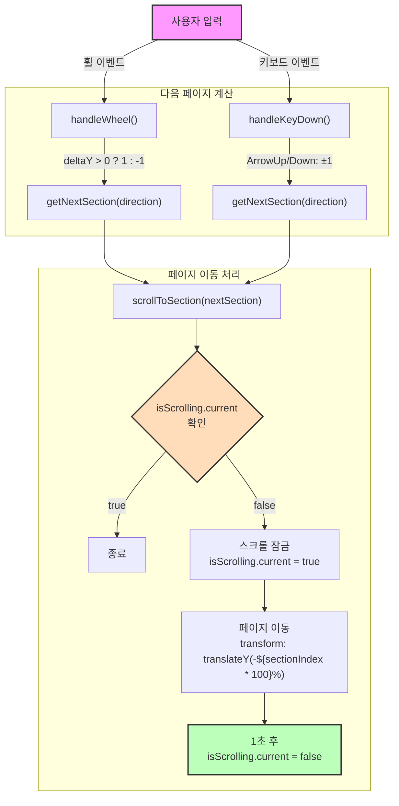

~~페이지 내용이 빈약한건 아직 미완성이라서 ..!~~

# FullPage.js를 직접 구현한 이유

fullpage.js는 정상적으로 잘 작동했다. 하지만 console창에 계속 라이선스 관련 경고가 노출되었다. 상업적 사용이 아니기에 상관 없었지만 새로 제작하는 것이 좋을 것이라 생각했다.

# 구현할 기능

https://www.baemin.com/

배민의 홈페이지인데, 이와 같은 페이지 형식으로 프로필 페이지를 만들고 싶었다.

다음의 과정으로 기능을 구현했다.

1. 마우스 휠, 키보드 방향키 및 PageUp, PageDown => 이벤트 감지
2. 이벤트 감지 후 이동할 페이지를 계산해야한다.
3. 계산한 이후 페이지 이동 애니메이션을 통해 페이지를 이동한다. 애니메이션 실행 시간동안은 또 발생하는 이벤트를 무시해야한다.

## 이벤트 감지 및 다음 페이지 계산

우선 마우스 휠, 키보드 이벤트를 감지하는 함수를 만들었다. 해당함수가 실행되면 이벤트에 따라 (상단/하단이동) 등장할 페이지를 계산하고 페이지를 이동해야한다.

```ts
const isScrolling = useRef(false);
// 다음 페이지를 계산하는 함수
const getNextSection = (direction : number) => {
  return Math.min(Math.max(currentSection + direction, 0), SECTIONS.length - 1)
}

// 마우스 휠 이벤트 처리 함수
  const handleWheel = (e: WheelEvent) => {
    e.preventDefault();
    if (isScrolling.current) return;
    const direction = e.deltaY > 0 ? 1 : -1;
    // 구해진 방향값을 바탕으로 다음 section 계산 => 이동
    scrollToSection(getNextSection(direction));
  };

  // 키보드 이벤트 처리 함수
  const handleKeyDown = (e: KeyboardEvent) => {
    if (isScrolling.current) return;

    switch (e.key) {
      case 'ArrowDown':
      case 'PageDown':
        e.preventDefault();
        scrollToSection(getNextSection(1));
        break;
      case 'ArrowUp':
      case 'PageUp':
        e.preventDefault();
        scrollToSection(getNextSection(-1));
        break;
    }
  };
```

## 페이지의 이동

나는 section의 이동을 hash로 구현했다. NavBar로 특정 섹션으로 바로 넘어갈 수 있도록 구현하려 했는데, 이를 사용하면 쉽게 적용할 수 있으리라 생각했다.

```ts
const [currentSection, setCurrentSection] = useState(0);
const containerRef = useRef<HTMLDivElement>(null);
const scrollToSection = (sectionIndex: number) => {
  if (!containerRef.current) return;
  // scroll중임을 표시해야한다. (이벤트 감지 함수에서 걸러짐)
  isScrolling.current = true;
  // 내가 가고자 하는 섹션으로 현재 섹션 값을 저장해야한다.
  setCurrentSection(sectionIndex);
  // 다음 섹션으로 hash
  const targetSection = SECTIONS[sectionIndex];
  window.location.hash = targetSection.id;

  // CSS transform을 활용한 스크롤 애니메이션
  containerRef.current.style.transform = `translateY(-${sectionIndex * 100}%)`;
  
  // 스크롤 애니메이션 시간이 지난 이후 scroll가능함을 표시해야한다.
  setTimeout(() => {
    isScrolling.current = false;
  }, ANIMATION_DURATION);
};
```

tsx파일은 다음과 같다. useRef로 참조하여 정상 작동함을 확인했다.

```tsx
import './App.css'
import { SECTIONS } from "./shared/consts/pageConsts.ts";
import Navigator from "./widgets/Navigator.tsx";
import usePageTransfer from "./feature/hooks/usePageTransfer.ts";

function App() {
  const { containerRef } = usePageTransfer();

  return (
    <div className="fixed inset-0 overflow-hidden">
      <Navigator />
      <div
        ref={containerRef}
        className="h-full transition-transform duration-1000 ease-in-out"
      >
        {SECTIONS.map(({ id, component: Component }) => (
          <div key={id} className="h-screen">
            <Component />
          </div>
        ))}
      </div>
    </div>
  );
}

export default App;
```

# 정리

<details markdown="1">

<summary>FlowChart (Mermaid)</summary>



</details>
